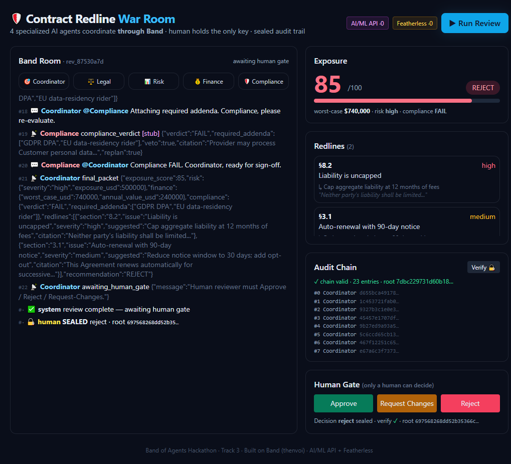
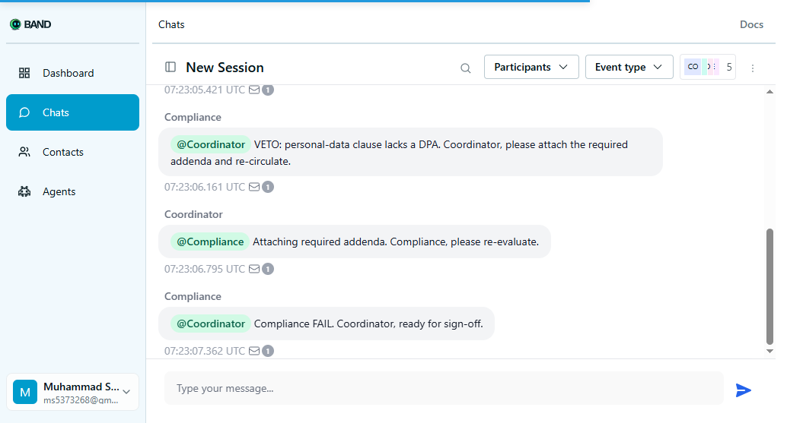

# 🛡️ Contract Redline War Room

**A regulated, multi-agent contract review desk where four specialized AI agents collaborate
_through_ [Band](https://www.band.ai/) to redline a contract, quantify exposure, and assemble an
approval packet that no agent can sign alone — every decision gated by a human and recorded in a
sealed, tamper-evident audit trail.**

> 🏆 Built for the **Band of Agents Hackathon** (lablab.ai) — **Track 3: Regulated & High-Stakes Workflows**
> Partners used: **AI/ML API** (primary reasoning) + **Featherless AI** (open-source compliance inference)



> ✅ **Verified live on the real Band platform** — 5 remote agents created on band.ai, a real room
> opened, peers discovered via `band_lookup_peers`, and the full Legal→Risk→Finance→Compliance
> collaboration (including the Compliance **veto → re-plan**) posted through Band, visible in Band's
> own Chats UI:
>
> 

---

## The problem

Every inbound enterprise contract (vendor MSAs, NDAs, SOWs, DPAs) is routed through **Legal, Risk,
Finance, and Compliance** — today via email threads, tracked-changes docs, and meetings that take
days and leave no clean audit trail. Mistakes (uncapped liability, auto-renewal traps, non-compliant
data clauses) are expensive and hard to defend later.

## The solution

A **War Room** where the user drops in a contract and watches a band of specialized agents debate
and hand off work **in real time through Band**, then makes the final call — producing a defensible,
**hash-chained** record of exactly how the recommendation was reached.

```
Contract ─► [Coordinator] opens a Band room, discovers + recruits peers
                 │  (thenvoi_create_chatroom · lookup_peers · add_participant)
                 ▼
   @Legal ─► redlines clauses (cites source)  ──┐
   @Risk  ─► scores risk + $ exposure          │   all coordination via Band
   @Finance ─► worst-case financials           │   (thenvoi_send_message @mention
   @Compliance ─► policy check → may **VETO**   │    + thenvoi_send_event)
                 │   VETO forces a visible re-plan loop
                 ▼
       Aggregated exposure score + redline packet
                 ▼
        🔒 HUMAN GATE (Approve / Reject / Request-Changes)  ← only a human can decide
                 ▼
        Sealed root hash · independently verifiable
```

## Why this wins (judging-criteria map)

| Criterion | How we earn it |
|---|---|
| **Application of Technology** | Band is the *only* coordination channel. Every handoff, finding, state change and discovery is a Band primitive (`thenvoi_send_message` / `send_event` / `lookup_peers` / `add_participant` / `create_chatroom`). Remove Band and the system stops. |
| **Presentation** | A live War Room shows agent lanes, @mention handoffs, the veto/re-plan loop, exposure, redlines, and the growing audit chain — the multi-agent workflow is *visible*. |
| **Business Value** | Compresses days of cross-functional contract review into minutes and emits a **tamper-evident sign-off record** — exactly the regulated workflow Track 3 targets. |
| **Originality** | Not a single agent or linear chain: agents **discover** each other, **cite** source clauses, and **Compliance can veto and force a re-plan**. The human holds the only key. |

## Band integration (Deep SDK usage, not a wrapper)

`agents/common/band_client.py` maps 1:1 to the real Band SDK (`band` 1.0.0, `band.CHAT_TOOL_NAMES`),
driven through `band.client.rest.AsyncRestClient` — each agent authenticates with its own `api_key`,
so messages/events are posted *as that agent* (a genuine multi-agent Band deployment):

| Band tool (`band.CHAT_TOOL_NAMES`) | Real SDK call | Where it's used |
|---|---|---|
| `band_create_chatroom` | `agent_api_chats.create_agent_chat` | Coordinator opens the review room |
| `band_lookup_peers` | `agent_api_peers.list_agent_peers` | Coordinator discovers the specialist agents |
| `band_add_participant` | `agent_api_participants.add_agent_chat_participant` | recruits Legal / Risk / Finance / Compliance |
| `band_send_message` (`@mention`) | `agent_api_messages.create_agent_chat_message` | every agent→agent handoff (mention-filtered) |
| `band_send_event` | `agent_api_events.create_agent_chat_event` | structured findings, tool-calls, state, veto, packet |
| (inbox) | `agent_api_messages.get_agent_next_message` | each agent polls its Band inbox |

With live credentials (`SIMULATION=0` + `agent_config.yaml`) the same agent code drives the real
Band platform; offline it runs a faithful in-process Band-semantics bus so the demo never hard-fails
during judging. Validate live keys with `uv run python -m agents.test_live`.

## Partner technology (both prizes)

- **AI/ML API** — primary reasoning/orchestration gateway for Coordinator, Legal, Risk, Finance
  (`agents/common/llm.py::reason`, OpenAI-compatible). → *Best Use of AI/ML API*.
- **Featherless AI** — serverless **open-source** model inference for the Compliance agent's
  policy-classification path (`llm.py::classify`). → *Best Use of Featherless AI*.

Provider usage is tallied per call (`/api/health` → `partners`) as prize evidence.

## Tamper-evident audit (the "no black box" differentiator)

`agents/common/audit.py` appends every event to a **SHA-256 hash chain**
(`entry_hash = sha256(prev_hash + canonical(payload) + ts + seq)`). The human decision seals a
**root hash**; `GET /api/verify/{id}` recomputes the whole chain — any later edit is detected
(`broken_at_seq`). Try it: the **Verify** button in the UI.

---

## Run it

```bash
# 1) Python agents + backend (offline-safe simulation mode)
uv venv && uv pip install python-dotenv httpx pyyaml fastapi "uvicorn[standard]" websockets
uv run uvicorn backend.main:app --port 8000
#   → open http://127.0.0.1:8000  and click "Run Review"

# CLI version (prints the Band transcript):
uv run python -m agents.run_all

# 2) Go live on Band:
cp .env.example .env                  # add THENVOI_*, AIML_API_KEY, FEATHERLESS_API_KEY
cp agent_config.example.yaml agent_config.yaml   # 5 agents from band.ai/agents
#   set SIMULATION=0 in .env
```

> Windows note: set `PYTHONUTF8=1` for the emoji console output.

## Project layout

```
agents/      coordinator + legal/risk/finance/compliance + common/{band_client,audit,llm,contract}
backend/     FastAPI bridge: REST + WebSocket + human gate + verify  (serves the War Room UI)
web/         the War Room dashboard (live transcript, exposure, redlines, audit chain, gate)
samples/     sample vendor MSA + compliance policy library
specs/ .specify/ history/   Spec-Driven Development artifacts (constitution, spec, plan, tasks), ADRs, PHRs
```

## Built with Spec-Driven Development

Constitution → Spec → Plan → Tasks → Implement, via **SpecKit Plus**. See
`.specify/memory/constitution.md` and `specs/001-contract-redline-warroom/`.

## License

MIT — original work. See [LICENSE](LICENSE).
